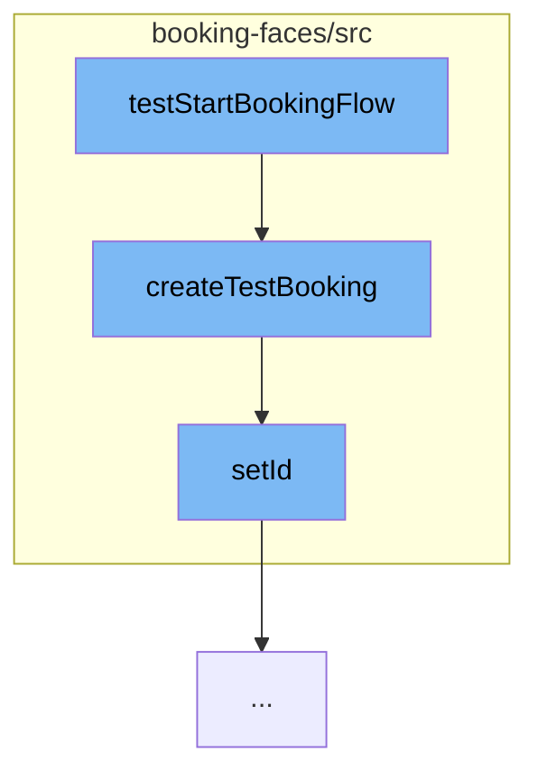

This document will cover the process of starting a booking flow in the Spring Web Flow project. The process includes:

1. Initiating the booking flow
2. Creating a test booking
3. Setting the ID for the booking.



<SwmSnippet path="/booking-faces/src/test/java/org/springframework/webflow/samples/booking/BookingFlowExecutionTests.java" line="1">

---

# Initiating the Booking Flow

The function <SwmToken path="/booking-mvc/src/test/java/org/springframework/webflow/samples/booking/BookingFlowExecutionTests.java" pos="30:5:5" line-data="    public void testStartBookingFlow() {">`testStartBookingFlow`</SwmToken> initiates the booking flow. It's the entry point for the process.

```java
package org.springframework.webflow.samples.booking;
```

---

</SwmSnippet>

<SwmSnippet path="/booking-faces/src/test/java/org/springframework/webflow/samples/booking/BookingFlowExecutionTests.java" line="74">

---

# Creating a Test Booking

The function <SwmToken path="/booking-faces/src/test/java/org/springframework/webflow/samples/booking/BookingFlowExecutionTests.java" pos="74:5:5" line-data="    private Booking createTestBooking() {">`createTestBooking`</SwmToken> is called by <SwmToken path="/booking-mvc/src/test/java/org/springframework/webflow/samples/booking/BookingFlowExecutionTests.java" pos="30:5:5" line-data="    public void testStartBookingFlow() {">`testStartBookingFlow`</SwmToken>. It creates a new booking instance with a hotel and a user. The hotel ID is set to 1 and the user is predefined.

```java
    private Booking createTestBooking() {
	Hotel hotel = new Hotel();
	hotel.setId(1L);
	hotel.setName("Jameson Inn");
	User user = new User("keith", "pass", "Keith Donald");
	Booking booking = new Booking(hotel, user);
	return booking;
    }
```

---

</SwmSnippet>

<SwmSnippet path="/booking-faces/src/main/java/org/springframework/webflow/samples/booking/Booking.java" line="92">

---

# Setting the ID for the Booking

The function <SwmToken path="/booking-faces/src/main/java/org/springframework/webflow/samples/booking/Booking.java" pos="92:5:5" line-data="	public void setId(Long id) {">`setId`</SwmToken> is called by <SwmToken path="/booking-faces/src/test/java/org/springframework/webflow/samples/booking/BookingFlowExecutionTests.java" pos="74:5:5" line-data="    private Booking createTestBooking() {">`createTestBooking`</SwmToken>. It sets the ID for the booking instance.

```java
	public void setId(Long id) {
		this.id = id;
	}
```

---

</SwmSnippet>

&nbsp;

*This is an auto-generated document by Swimm AI 🌊 and has not yet been verified by a human*

<SwmMeta version="3.0.0" repo-id="Z2l0aHViJTNBJTNBc3ByaW5nLXdlYmZsb3ctc2FtcGxlcyUzQSUzQWdpbGFkbmF2b3Q=" repo-name="spring-webflow-samples"><sup>Powered by [Swimm](https://app.swimm.io/)</sup></SwmMeta>
