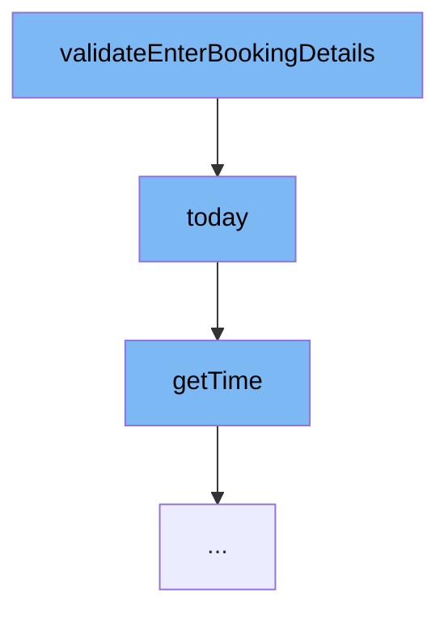

This document will cover the process of validating booking details in the Spring Web Flow samples project. The process includes:

1. The function <SwmToken path="/booking-faces/src/main/java/org/springframework/webflow/samples/booking/Booking.java" pos="204:5:5" line-data="	public void validateEnterBookingDetails(ValidationContext context) {">`validateEnterBookingDetails`</SwmToken> and its role in the process.
2. The function <SwmToken path="/booking-faces/src/main/java/org/springframework/webflow/samples/booking/Booking.java" pos="215:5:5" line-data="	private Date today() {">`today`</SwmToken> and how it contributes to the validation process.
3. The function <SwmToken path="/booking-faces/src/main/java/org/springframework/webflow/samples/booking/Booking.java" pos="218:5:5" line-data="		return calendar.getTime();">`getTime`</SwmToken> and its role in obtaining the current time.



<SwmSnippet path="/booking-faces/src/main/java/org/springframework/webflow/samples/booking/Booking.java" line="1">

---

# The function <SwmToken path="/booking-faces/src/main/java/org/springframework/webflow/samples/booking/Booking.java" pos="204:5:5" line-data="	public void validateEnterBookingDetails(ValidationContext context) {">`validateEnterBookingDetails`</SwmToken>

The function <SwmToken path="/booking-faces/src/main/java/org/springframework/webflow/samples/booking/Booking.java" pos="204:5:5" line-data="	public void validateEnterBookingDetails(ValidationContext context) {">`validateEnterBookingDetails`</SwmToken> is the starting point of the booking validation process. It's responsible for initiating the validation of the entered booking details.

```java
package org.springframework.webflow.samples.booking;
```

---

</SwmSnippet>

<SwmSnippet path="/booking-faces/src/main/java/org/springframework/webflow/samples/booking/Booking.java" line="215">

---

# The function <SwmToken path="/booking-faces/src/main/java/org/springframework/webflow/samples/booking/Booking.java" pos="215:5:5" line-data="	private Date today() {">`today`</SwmToken>

The function <SwmToken path="/booking-faces/src/main/java/org/springframework/webflow/samples/booking/Booking.java" pos="215:5:5" line-data="	private Date today() {">`today`</SwmToken> is called within <SwmToken path="/booking-faces/src/main/java/org/springframework/webflow/samples/booking/Booking.java" pos="204:5:5" line-data="	public void validateEnterBookingDetails(ValidationContext context) {">`validateEnterBookingDetails`</SwmToken>. It retrieves the current date, subtracts one day from it, and returns the result. This is used in the context of booking validation to ensure that the booking date is not in the past.

```java
	private Date today() {
		Calendar calendar = Calendar.getInstance();
		calendar.add(Calendar.DAY_OF_MONTH, -1);
		return calendar.getTime();
	}
```

---

</SwmSnippet>

<SwmSnippet path="/primefaces-showcase/src/main/java/org/springframework/samples/webflow/poller/CurrentTimeBean.java" line="10">

---

# The function <SwmToken path="/primefaces-showcase/src/main/java/org/springframework/samples/webflow/poller/CurrentTimeBean.java" pos="10:5:5" line-data="	public Date getTime() {">`getTime`</SwmToken>

The function <SwmToken path="/primefaces-showcase/src/main/java/org/springframework/samples/webflow/poller/CurrentTimeBean.java" pos="10:5:5" line-data="	public Date getTime() {">`getTime`</SwmToken> is called within <SwmToken path="/booking-faces/src/main/java/org/springframework/webflow/samples/booking/Booking.java" pos="215:5:5" line-data="	private Date today() {">`today`</SwmToken>. It simply returns the current date and time. This is used in the <SwmToken path="/booking-faces/src/main/java/org/springframework/webflow/samples/booking/Booking.java" pos="215:5:5" line-data="	private Date today() {">`today`</SwmToken> function to get the current date before subtracting one day.

```java
	public Date getTime() {
		return new Date();
	}
```

---

</SwmSnippet>

&nbsp;

*This is an auto-generated document by Swimm AI 🌊 and has not yet been verified by a human*

<SwmMeta version="3.0.0" repo-id="Z2l0aHViJTNBJTNBc3ByaW5nLXdlYmZsb3ctc2FtcGxlcyUzQSUzQWdpbGFkbmF2b3Q=" repo-name="spring-webflow-samples"><sup>Powered by [Swimm](https://app.swimm.io/)</sup></SwmMeta>
