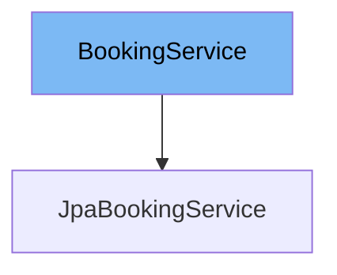

This document will cover the `BookingService` interface in the `spring-webflow-samples` repository. We will cover:

1. What the `BookingService` interface is and its purpose.
2. The variables and functions defined in `BookingService`.
3. An example of how to use `BookingService` in `JpaBookingService`.



# What is BookingService

`BookingService` is an interface in the `spring-webflow-samples` repository. It is used for retrieving hotels and bookings from a backing repository and also supports the ability to cancel a booking.

<SwmSnippet path="/booking-mvc/src/main/java/org/springframework/webflow/samples/booking/BookingService.java" line="16">

---

# Variables and functions

The function `findBookings` is used to find bookings made by a given user. It takes a username as a parameter and returns a list of bookings made by that user.

```java
    List<Booking> findBookings(String username);
```

---

</SwmSnippet>

<SwmSnippet path="/booking-mvc/src/main/java/org/springframework/webflow/samples/booking/BookingService.java" line="23">

---

The function `findHotels` is used to find hotels available for booking by some criteria. It takes a `SearchCriteria` object as a parameter and returns a list of hotels meeting the criteria.

```java
    List<Hotel> findHotels(SearchCriteria criteria);
```

---

</SwmSnippet>

<SwmSnippet path="/booking-mvc/src/main/java/org/springframework/webflow/samples/booking/BookingService.java" line="30">

---

The function `findHotelById` is used to find a hotel by its identifier. It takes a hotel id as a parameter and returns the corresponding hotel.

```java
    Hotel findHotelById(Long id);
```

---

</SwmSnippet>

<SwmSnippet path="/booking-mvc/src/main/java/org/springframework/webflow/samples/booking/BookingService.java" line="38">

---

The function `createBooking` is used to create a new, transient hotel booking instance for the given user. It takes a hotel id and a username as parameters and returns the new transient booking instance.

```java
    Booking createBooking(Long hotelId, String userName);
```

---

</SwmSnippet>

<SwmSnippet path="/booking-mvc/src/main/java/org/springframework/webflow/samples/booking/BookingService.java" line="44">

---

The function `persistBooking` is used to persist the booking to the database. It takes a `Booking` object as a parameter.

```java
    void persistBooking(Booking booking);
```

---

</SwmSnippet>

<SwmSnippet path="/booking-mvc/src/main/java/org/springframework/webflow/samples/booking/BookingService.java" line="50">

---

The function `cancelBooking` is used to cancel an existing booking. It takes a booking id as a parameter.

```java
    void cancelBooking(Long id);
```

---

</SwmSnippet>

<SwmSnippet path="/booking-mvc/src/main/java/org/springframework/webflow/samples/booking/JpaBookingService.java" line="18">

---

# Usage example

`JpaBookingService` is an example of how to use `BookingService`. It implements `BookingService` and provides the implementation for all the functions defined in `BookingService`. It uses a JPA entity manager to issue data access calls against the backing repository.

```java
@Service("bookingService")
@Repository
public class JpaBookingService implements BookingService {

	private EntityManager em;

	@PersistenceContext
	public void setEntityManager(EntityManager em) {
		this.em = em;
	}

	@Transactional(readOnly = true)
	@SuppressWarnings("unchecked")
	public List<Booking> findBookings(String username) {
		if (username != null) {
			return em.createQuery("select b from Booking b where b.user.username = :username order by b.checkinDate")
					.setParameter("username", username).getResultList();
		} else {
			return null;
		}
	}
```

---

</SwmSnippet>

&nbsp;

*This is an auto-generated document by Swimm AI 🌊 and has not yet been verified by a human*

<SwmMeta version="3.0.0" repo-id="Z2l0aHViJTNBJTNBc3ByaW5nLXdlYmZsb3ctc2FtcGxlcyUzQSUzQWdpbGFkbmF2b3Q=" repo-name="spring-webflow-samples"><sup>Powered by [Swimm](/)</sup></SwmMeta>
