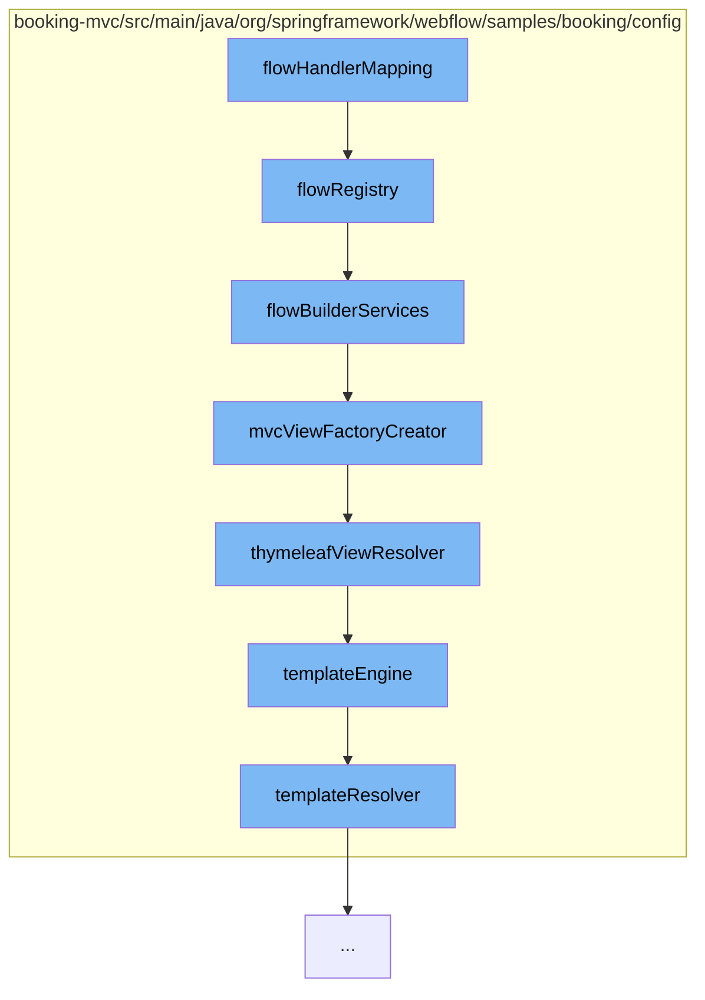

This document will cover the process of configuring the Spring Web Flow in the booking-mvc application, which includes:

1. Defining the flow registry
2. Setting up the flow builder services
3. Creating the MVC view factory
4. Configuring the Thymeleaf view resolver
5. Setting up the template engine
6. Defining the template resolver.



<SwmSnippet path="/booking-mvc/src/main/java/org/springframework/webflow/samples/booking/config/WebFlowConfig.java" line="29" repo-id="Z2l0aHViJTNBJTNBc3ByaW5nLXdlYmZsb3ctc2FtcGxlcyUzQSUzQWdpbGFkbmF2b3Q=">

---

# Defining the flow registry

The `flowRegistry` method defines the flow registry. It sets the base path and adds a flow location pattern, which is used to locate the XML files that define the flows.

```java
	@Bean
	public FlowDefinitionRegistry flowRegistry() {
		return getFlowDefinitionRegistryBuilder(flowBuilderServices())
				.setBasePath("/WEB-INF")
				.addFlowLocationPattern("/**/*-flow.xml").build();
	}
```

---

</SwmSnippet>

<SwmSnippet path="/booking-mvc/src/main/java/org/springframework/webflow/samples/booking/config/WebFlowConfig.java" line="36" repo-id="Z2l0aHViJTNBJTNBc3ByaW5nLXdlYmZsb3ctc2FtcGxlcyUzQSUzQWdpbGFkbmF2b3Q=">

---

# Setting up the flow builder services

The `flowBuilderServices` method sets up the flow builder services. It sets the view factory creator and the validator, and enables the development mode.

```java
	@Bean
	public FlowBuilderServices flowBuilderServices() {
		return getFlowBuilderServicesBuilder()
				.setViewFactoryCreator(mvcViewFactoryCreator())
				.setValidator(validator())
				.setDevelopmentMode(true)
				.build();
	}
```

---

</SwmSnippet>

<SwmSnippet path="/booking-mvc/src/main/java/org/springframework/webflow/samples/booking/config/WebFlowConfig.java" line="45" repo-id="Z2l0aHViJTNBJTNBc3ByaW5nLXdlYmZsb3ctc2FtcGxlcyUzQSUzQWdpbGFkbmF2b3Q=">

---

# Creating the MVC view factory

The `mvcViewFactoryCreator` method creates the MVC view factory. It sets the view resolvers and enables the use of Spring bean binding.

```java
	@Bean
	public MvcViewFactoryCreator mvcViewFactoryCreator() {
		MvcViewFactoryCreator factoryCreator = new MvcViewFactoryCreator();
		factoryCreator.setViewResolvers(Collections.singletonList(this.webMvcConfig.thymeleafViewResolver()));
		factoryCreator.setUseSpringBeanBinding(true);
		return factoryCreator;
	}
```

---

</SwmSnippet>

<SwmSnippet path="/booking-mvc/src/main/java/org/springframework/webflow/samples/booking/config/WebMvcConfig.java" line="81" repo-id="Z2l0aHViJTNBJTNBc3ByaW5nLXdlYmZsb3ctc2FtcGxlcyUzQSUzQWdpbGFkbmF2b3Q=">

---

# Configuring the Thymeleaf view resolver

The `thymeleafViewResolver` method configures the Thymeleaf view resolver. It sets the view class and the template engine.

```java
	@Bean
	public AjaxThymeleafViewResolver thymeleafViewResolver() {
		AjaxThymeleafViewResolver viewResolver = new AjaxThymeleafViewResolver();
		viewResolver.setViewClass(FlowAjaxThymeleafView.class);
		viewResolver.setTemplateEngine(templateEngine());
		return viewResolver;
	}
```

---

</SwmSnippet>

<SwmSnippet path="/booking-mvc/src/main/java/org/springframework/webflow/samples/booking/config/WebMvcConfig.java" line="89" repo-id="Z2l0aHViJTNBJTNBc3ByaW5nLXdlYmZsb3ctc2FtcGxlcyUzQSUzQWdpbGFkbmF2b3Q=">

---

# Setting up the template engine

The `templateEngine` method sets up the template engine. It sets the template resolver and adds additional dialects.

```java
	@Bean
	public SpringTemplateEngine templateEngine(){

		Set<IDialect> dialects = new LinkedHashSet<>();
		dialects.add(new SpringSecurityDialect());

		SpringTemplateEngine templateEngine = new SpringTemplateEngine();
		templateEngine.setTemplateResolver(templateResolver());
		templateEngine.setAdditionalDialects(dialects);
		return templateEngine;
	}
```

---

</SwmSnippet>

<SwmSnippet path="/booking-mvc/src/main/java/org/springframework/webflow/samples/booking/config/WebMvcConfig.java" line="101" repo-id="Z2l0aHViJTNBJTNBc3ByaW5nLXdlYmZsb3ctc2FtcGxlcyUzQSUzQWdpbGFkbmF2b3Q=">

---

# Defining the template resolver

The `templateResolver` method defines the template resolver. It sets the prefix, suffix, and template mode.

```java
	@Bean
	public WebApplicationTemplateResolver templateResolver() {
		IWebApplication application = JakartaServletWebApplication.buildApplication(this.servletContext);
		WebApplicationTemplateResolver resolver = new WebApplicationTemplateResolver(application);
		resolver.setPrefix("/WEB-INF/");
		resolver.setSuffix(".html");
		resolver.setTemplateMode("HTML5");
		return resolver;
	}
```

---

</SwmSnippet>

&nbsp;

*This is an auto-generated document by Swimm AI 🌊 and has not yet been verified by a human*

<SwmMeta version="3.0.0" repo-id="Z2l0aHViJTNBJTNBc3ByaW5nLXdlYmZsb3ctc2FtcGxlcyUzQSUzQWdpbGFkbmF2b3Q=" repo-name="spring-webflow-samples"><sup>Powered by [Swimm](https://app.swimm.io/)</sup></SwmMeta>
