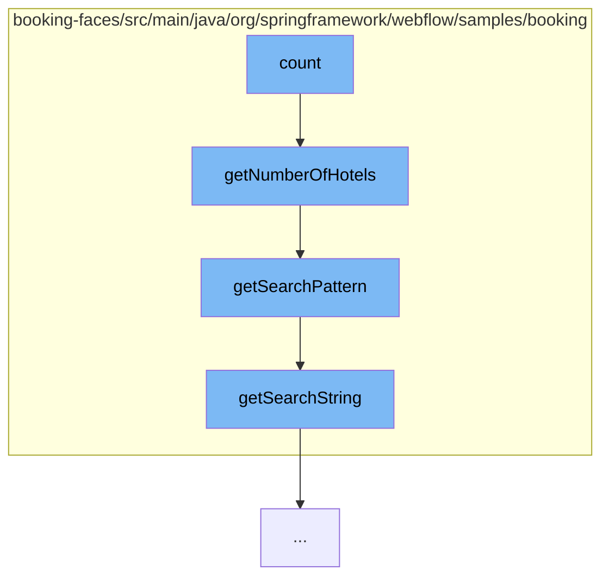

This document will cover the process of counting hotels in the booking system, which includes:

1. Invoking the count function in HotelLazyDataModel
2. Retrieving the number of hotels from the JpaBookingService
3. Forming the search pattern
4. Extracting the search string from the SearchCriteria.



<SwmSnippet path="/booking-faces/src/main/java/org/springframework/webflow/samples/booking/HotelLazyDataModel.java" line="1" repo-id="Z2l0aHViJTNBJTNBc3ByaW5nLXdlYmZsb3ctc2FtcGxlcyUzQSUzQWdpbGFkbmF2b3Q=">

---

# Invoking the count function in HotelLazyDataModel

The count function in HotelLazyDataModel initiates the process of counting hotels. It calls the getNumberOfHotels function in JpaBookingService.

```java
package org.springframework.webflow.samples.booking;
```

---

</SwmSnippet>

<SwmSnippet path="/booking-faces/src/main/java/org/springframework/webflow/samples/booking/JpaBookingService.java" line="57" repo-id="Z2l0aHViJTNBJTNBc3ByaW5nLXdlYmZsb3ctc2FtcGxlcyUzQSUzQWdpbGFkbmF2b3Q=">

---

# Retrieving the number of hotels from the JpaBookingService

The getNumberOfHotels function retrieves the number of hotels based on the search criteria. It forms a search pattern and executes a query to count the hotels that match the pattern.

```java
	@Transactional(readOnly = true)
	public int getNumberOfHotels(SearchCriteria criteria) {
		String pattern = getSearchPattern(criteria);
		Long count = (Long) em
				.createQuery(
						"select count(h.id) from Hotel h where lower(h.name) like :pattern or lower(h.city) like :pattern "
								+ "or lower(h.zip) like :pattern or lower(h.address) like :pattern")
								.setParameter("pattern", pattern).getSingleResult();
		return count.intValue();
	}
```

---

</SwmSnippet>

<SwmSnippet path="/booking-faces/src/main/java/org/springframework/webflow/samples/booking/JpaBookingService.java" line="94" repo-id="Z2l0aHViJTNBJTNBc3ByaW5nLXdlYmZsb3ctc2FtcGxlcyUzQSUzQWdpbGFkbmF2b3Q=">

---

# Forming the search pattern

The getSearchPattern function forms a search pattern based on the search string in the criteria. If the search string is present, it is converted to lower case and any '\*' characters are replaced with '%'. If the search string is not present, the pattern is set to '%'.

```java
	// helpers

	private String getSearchPattern(SearchCriteria criteria) {
		if (StringUtils.hasText(criteria.getSearchString())) {
			return "%" + criteria.getSearchString().toLowerCase().replace('*', '%') + "%";
		} else {
			return "%";
		}
	}
```

---

</SwmSnippet>

<SwmSnippet path="/booking-faces/src/main/java/org/springframework/webflow/samples/booking/SearchCriteria.java" line="28" repo-id="Z2l0aHViJTNBJTNBc3ByaW5nLXdlYmZsb3ctc2FtcGxlcyUzQSUzQWdpbGFkbmF2b3Q=">

---

# Extracting the search string from the SearchCriteria

The getSearchString function simply returns the search string from the SearchCriteria object.

```java
	public String getSearchString() {
		return searchString;
	}
```

---

</SwmSnippet>

&nbsp;

*This is an auto-generated document by Swimm AI 🌊 and has not yet been verified by a human*

<SwmMeta version="3.0.0" repo-id="Z2l0aHViJTNBJTNBc3ByaW5nLXdlYmZsb3ctc2FtcGxlcyUzQSUzQWdpbGFkbmF2b3Q=" repo-name="spring-webflow-samples"><sup>Powered by [Swimm](https://app.swimm.io/)</sup></SwmMeta>
