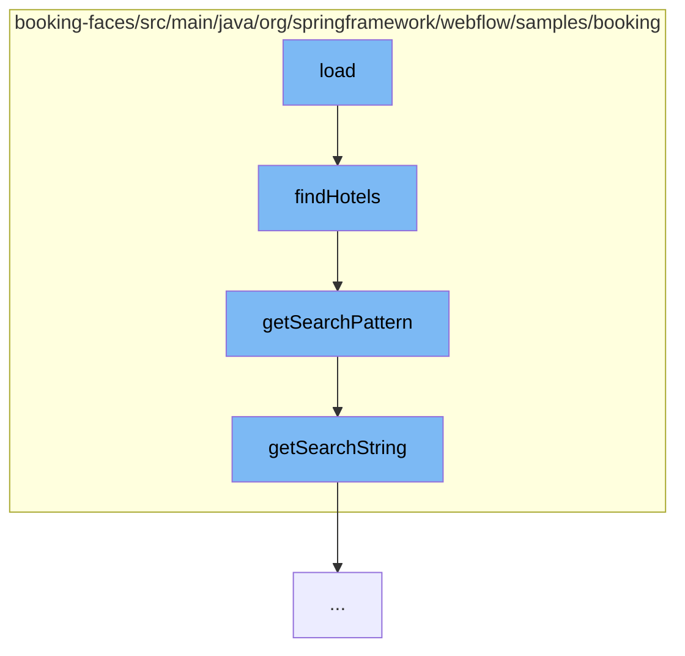

This document will cover the process of loading hotel data in the Spring Web Flow samples project. The process includes the following steps:

1. Invoking the `load` function in `HotelLazyDataModel.java`
2. Calling the `findHotels` function in `JpaBookingService.java`
3. Retrieving the search pattern via `getSearchPattern` function
4. Getting the search string from `SearchCriteria.java`.



<SwmSnippet path="/booking-faces/src/main/java/org/springframework/webflow/samples/booking/HotelLazyDataModel.java" line="1" repo-id="Z2l0aHViJTNBJTNBc3ByaW5nLXdlYmZsb3ctc2FtcGxlcyUzQSUzQWdpbGFkbmF2b3Q=">

---

# Invoking the `load` function

The `load` function in `HotelLazyDataModel.java` is the entry point for this flow. It is responsible for loading hotel data.

```java
package org.springframework.webflow.samples.booking;
```

---

</SwmSnippet>

<SwmSnippet path="/booking-faces/src/main/java/org/springframework/webflow/samples/booking/JpaBookingService.java" line="43" repo-id="Z2l0aHViJTNBJTNBc3ByaW5nLXdlYmZsb3ctc2FtcGxlcyUzQSUzQWdpbGFkbmF2b3Q=">

---

# Calling the `findHotels` function

The `findHotels` function is called by `load`. It takes a `SearchCriteria` object, and other parameters to find and return a list of hotels that match the criteria.

```java
	@Transactional(readOnly = true)
	@SuppressWarnings("unchecked")
	public List<Hotel> findHotels(SearchCriteria criteria, int firstResult, String orderBy, boolean ascending) {
		String pattern = getSearchPattern(criteria);
		orderBy = (orderBy != null) ? orderBy : "name";
		String orderDirection = (ascending) ? " ASC" : " DESC";
		return em
				.createQuery(
						"select h from Hotel h where lower(h.name) like :pattern or lower(h.city) like :pattern "
								+ "or lower(h.zip) like :pattern or lower(h.address) like :pattern order by h."
								+ orderBy + orderDirection).setParameter("pattern", pattern)
								.setMaxResults(criteria.getPageSize()).setFirstResult(firstResult).getResultList();
	}
```

---

</SwmSnippet>

<SwmSnippet path="/booking-faces/src/main/java/org/springframework/webflow/samples/booking/JpaBookingService.java" line="94" repo-id="Z2l0aHViJTNBJTNBc3ByaW5nLXdlYmZsb3ctc2FtcGxlcyUzQSUzQWdpbGFkbmF2b3Q=">

---

# Retrieving the search pattern

`getSearchPattern` is a helper function used by `findHotels` to generate a search pattern from the `SearchCriteria` object.

```java
	// helpers

	private String getSearchPattern(SearchCriteria criteria) {
		if (StringUtils.hasText(criteria.getSearchString())) {
			return "%" + criteria.getSearchString().toLowerCase().replace('*', '%') + "%";
		} else {
			return "%";
		}
	}
```

---

</SwmSnippet>

<SwmSnippet path="/booking-faces/src/main/java/org/springframework/webflow/samples/booking/SearchCriteria.java" line="28" repo-id="Z2l0aHViJTNBJTNBc3ByaW5nLXdlYmZsb3ctc2FtcGxlcyUzQSUzQWdpbGFkbmF2b3Q=">

---

# Getting the search string

`getSearchString` is a method in `SearchCriteria.java` that returns the search string. This string is used by `getSearchPattern` to generate the search pattern.

```java
	public String getSearchString() {
		return searchString;
	}
```

---

</SwmSnippet>

&nbsp;

*This is an auto-generated document by Swimm AI 🌊 and has not yet been verified by a human*

<SwmMeta version="3.0.0" repo-id="Z2l0aHViJTNBJTNBc3ByaW5nLXdlYmZsb3ctc2FtcGxlcyUzQSUzQWdpbGFkbmF2b3Q=" repo-name="spring-webflow-samples"><sup>Powered by [Swimm](https://app.swimm.io/)</sup></SwmMeta>
