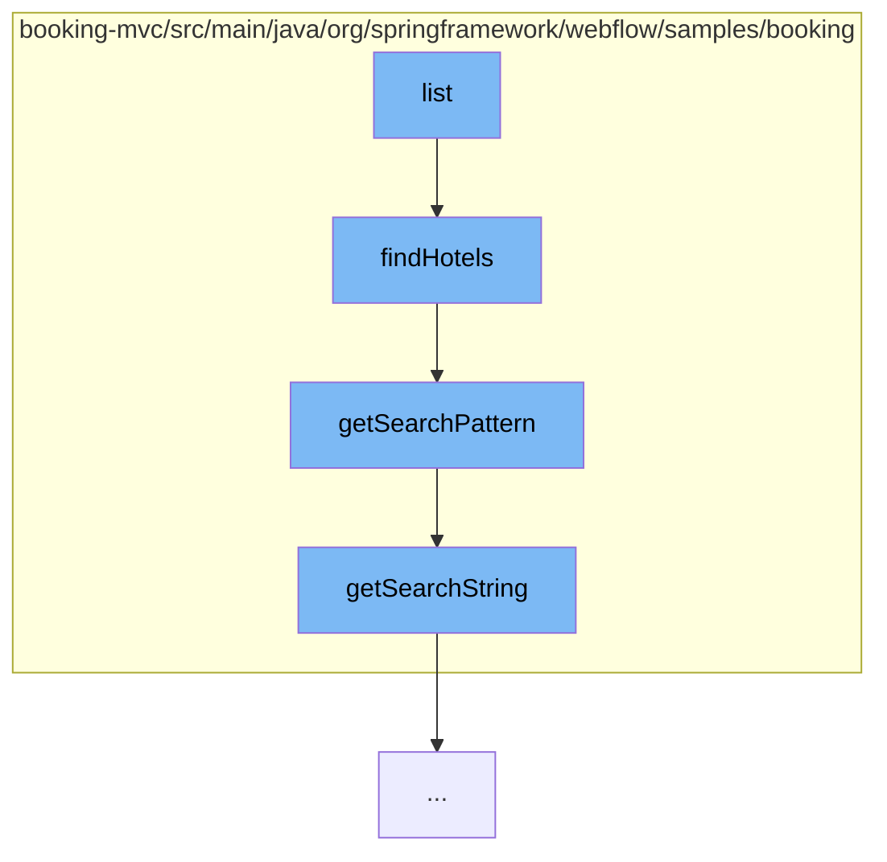

This document will cover the process of searching for hotels in the Spring Web Flow project. The process includes the following steps:

1. Invoking the `list` function in `HotelsController.java`
2. Calling the `findHotels` function in `JpaBookingService.java`
3. Executing the `getSearchPattern` function in `JpaBookingService.java`
4. Running the `getSearchString` function in `SearchCriteria.java`.



# Invoking the `list` function in `HotelsController.java`

The process starts with the `list` function in `HotelsController.java`. This function is responsible for initiating the search for hotels based on the provided search criteria.

<SwmSnippet path="/booking-mvc/src/main/java/org/springframework/webflow/samples/booking/JpaBookingService.java" line="40" repo-id="Z2l0aHViJTNBJTNBc3ByaW5nLXdlYmZsb3ctc2FtcGxlcyUzQSUzQWdpbGFkbmF2b3Q=">

---

# Calling the `findHotels` function in `JpaBookingService.java`

The `list` function then calls the `findHotels` function in `JpaBookingService.java`. This function takes the search criteria as input and uses it to construct a query to find matching hotels. It does this by calling the `getSearchPattern` function to get the search pattern and then using this pattern to query the database.

```java
	@Transactional(readOnly = true)
	@SuppressWarnings("unchecked")
	public List<Hotel> findHotels(SearchCriteria criteria) {
		String pattern = getSearchPattern(criteria);
		int startIndex = criteria.getPage() * criteria.getPageSize();
		return em
				.createQuery(
						"select h from Hotel h where lower(h.name) like :pattern or lower(h.city) like :pattern "
								+ " or lower(h.zip) like :pattern or lower(h.address) like :pattern")
				.setParameter("pattern", pattern).setFirstResult(startIndex).setMaxResults(criteria.getPageSize())
				.getResultList();
	}
```

---

</SwmSnippet>

<SwmSnippet path="/booking-mvc/src/main/java/org/springframework/webflow/samples/booking/JpaBookingService.java" line="81" repo-id="Z2l0aHViJTNBJTNBc3ByaW5nLXdlYmZsb3ctc2FtcGxlcyUzQSUzQWdpbGFkbmF2b3Q=">

---

# Executing the `getSearchPattern` function in `JpaBookingService.java`

The `getSearchPattern` function in `JpaBookingService.java` is responsible for converting the search string from the search criteria into a pattern that can be used in the database query. It does this by calling the `getSearchString` function to get the search string and then converting this string into a pattern.

```java
	private String getSearchPattern(SearchCriteria criteria) {
		if (StringUtils.hasText(criteria.getSearchString())) {
			return "%" + criteria.getSearchString().toLowerCase().replace('*', '%') + "%";
		} else {
			return "%";
		}
	}
```

---

</SwmSnippet>

<SwmSnippet path="/booking-mvc/src/main/java/org/springframework/webflow/samples/booking/SearchCriteria.java" line="28" repo-id="Z2l0aHViJTNBJTNBc3ByaW5nLXdlYmZsb3ctc2FtcGxlcyUzQSUzQWdpbGFkbmF2b3Q=">

---

# Running the `getSearchString` function in `SearchCriteria.java`

The `getSearchString` function in `SearchCriteria.java` simply returns the search string from the search criteria. This string is then used by the `getSearchPattern` function to create the search pattern.

```java
	public String getSearchString() {
		return searchString;
	}
```

---

</SwmSnippet>

&nbsp;

*This is an auto-generated document by Swimm AI 🌊 and has not yet been verified by a human*

<SwmMeta version="3.0.0" repo-id="Z2l0aHViJTNBJTNBc3ByaW5nLXdlYmZsb3ctc2FtcGxlcyUzQSUzQWdpbGFkbmF2b3Q=" repo-name="spring-webflow-samples"><sup>Powered by [Swimm](https://app.swimm.io/)</sup></SwmMeta>
