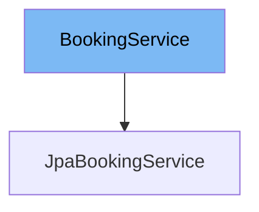

This document will cover the `BookingService` interface in the Spring Web Flow samples repository. We will cover:

1. What is `BookingService`.
2. The variables and functions defined in `BookingService`.
3. An example of how to use `BookingService` in `JpaBookingService`.



# What is BookingService

`BookingService` is an interface in the `booking-faces` module of the Spring Web Flow samples repository. It defines the contract for a service that retrieves hotels and bookings from a backing repository and supports the ability to cancel a booking.

<SwmSnippet path="/booking-faces/src/main/java/org/springframework/webflow/samples/booking/BookingService.java" line="16">

---

# Variables and functions

The function `findBookings` is used to find bookings made by a given user. It takes a username as a parameter and returns a list of bookings made by that user.

```java
    List<Booking> findBookings(String username);
```

---

</SwmSnippet>

<SwmSnippet path="/booking-faces/src/main/java/org/springframework/webflow/samples/booking/BookingService.java" line="26">

---

The function `findHotels` is used to find hotels available for booking based on some search criteria. It takes a `SearchCriteria` object, an index of the first result to return, a field to sort by, and a boolean indicating whether the sorting should be in ascending order. It returns a list of hotels meeting the criteria.

```java
    List<Hotel> findHotels(SearchCriteria criteria, int firstResult, String sortBy, boolean ascending);
```

---

</SwmSnippet>

<SwmSnippet path="/booking-faces/src/main/java/org/springframework/webflow/samples/booking/BookingService.java" line="33">

---

The function `findHotelById` is used to find a hotel by its identifier. It takes a hotel id as a parameter and returns the corresponding hotel.

```java
    Hotel findHotelById(Long id);
```

---

</SwmSnippet>

<SwmSnippet path="/booking-faces/src/main/java/org/springframework/webflow/samples/booking/BookingService.java" line="41">

---

The function `createBooking` is used to create a new, transient hotel booking instance for a given user. It takes a hotel id and a username as parameters and returns the new transient booking instance.

```java
    Booking createBooking(Long hotelId, String userName);
```

---

</SwmSnippet>

<SwmSnippet path="/booking-faces/src/main/java/org/springframework/webflow/samples/booking/BookingService.java" line="47">

---

The function `persistBooking` is used to persist a booking to the database. It takes a `Booking` object as a parameter.

```java
    void persistBooking(Booking booking);
```

---

</SwmSnippet>

<SwmSnippet path="/booking-faces/src/main/java/org/springframework/webflow/samples/booking/BookingService.java" line="53">

---

The function `cancelBooking` is used to cancel an existing booking. It takes a `Booking` object as a parameter.

```java
    void cancelBooking(Booking booking);
```

---

</SwmSnippet>

<SwmSnippet path="/booking-faces/src/main/java/org/springframework/webflow/samples/booking/BookingService.java" line="60">

---

The function `getNumberOfHotels` is used to return the total number of hotels for the given criteria. It takes a `SearchCriteria` object as a parameter and returns the number of matching hotels.

```java
    int getNumberOfHotels(SearchCriteria criteria);
```

---

</SwmSnippet>

<SwmSnippet path="/booking-faces/src/main/java/org/springframework/webflow/samples/booking/JpaBookingService.java" line="19">

---

# Usage example

`JpaBookingService` is an example of how to use the `BookingService` interface. It is a JPA-based implementation of the `BookingService` that delegates to a JPA entity manager to issue data access calls against the backing repository. The `EntityManager` reference is provided by the managing container (Spring) automatically.

```java
@Service("bookingService")
@Repository
public class JpaBookingService implements BookingService, Serializable {

	private static final long serialVersionUID = 1L;

	private EntityManager em;

	@PersistenceContext
	public void setEntityManager(EntityManager em) {
		this.em = em;
	}

	@Transactional(readOnly = true)
	@SuppressWarnings("unchecked")
	public List<Booking> findBookings(String username) {
		if (username != null) {
			return em.createQuery("select b from Booking b where b.user.username = :username order by b.checkinDate")
					.setParameter("username", username).getResultList();
		} else {
			return null;
```

---

</SwmSnippet>

&nbsp;

*This is an auto-generated document by Swimm AI 🌊 and has not yet been verified by a human*

<SwmMeta version="3.0.0" repo-id="Z2l0aHViJTNBJTNBc3ByaW5nLXdlYmZsb3ctc2FtcGxlcyUzQSUzQWdpbGFkbmF2b3Q=" repo-name="spring-webflow-samples"><sup>Powered by [Swimm](/)</sup></SwmMeta>
