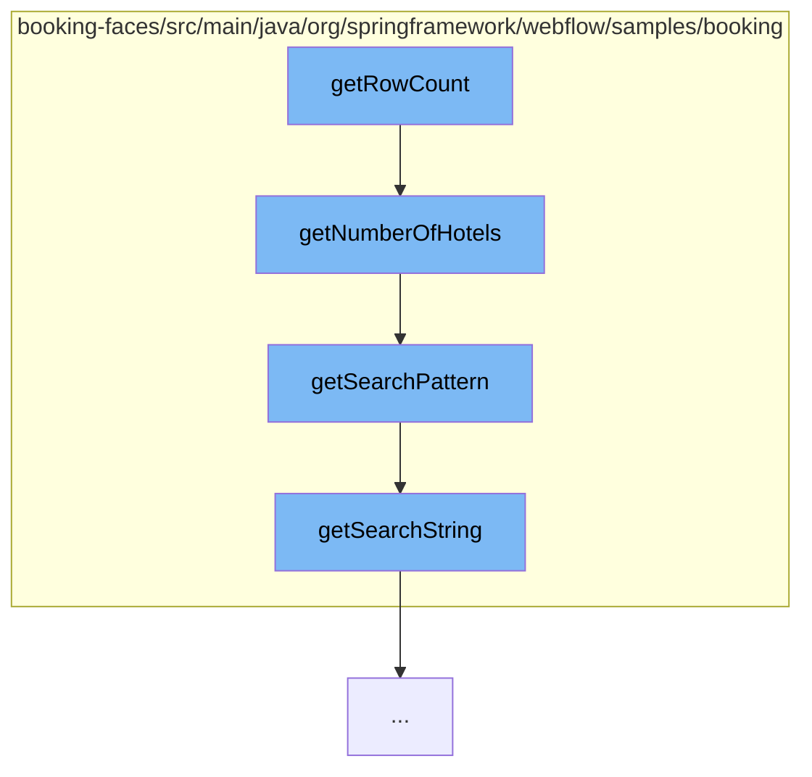

This document will cover the process of retrieving the row count in the HotelLazyDataModel, which includes:

1. Invoking the getRowCount function
2. Calling the getNumberOfHotels function
3. Utilizing the getSearchPattern function
4. Accessing the getSearchString function.



<SwmSnippet path="/booking-faces/src/main/java/org/springframework/webflow/samples/booking/HotelLazyDataModel.java" line="1" repo-id="Z2l0aHViJTNBJTNBc3ByaW5nLXdlYmZsb3ctc2FtcGxlcyUzQSUzQWdpbGFkbmF2b3Q=">

---

# Invoking the getRowCount function

The `getRowCount` function is the starting point of this flow. It is responsible for initiating the process of retrieving the number of rows (hotels) based on certain search criteria.

```java
package org.springframework.webflow.samples.booking;
```

---

</SwmSnippet>

<SwmSnippet path="/booking-faces/src/main/java/org/springframework/webflow/samples/booking/JpaBookingService.java" line="57" repo-id="Z2l0aHViJTNBJTNBc3ByaW5nLXdlYmZsb3ctc2FtcGxlcyUzQSUzQWdpbGFkbmF2b3Q=">

---

# Calling the getNumberOfHotels function

The `getNumberOfHotels` function is called next. It takes a `SearchCriteria` object as an argument and uses it to generate a search pattern. This function then executes a query to count the number of hotels that match the search pattern.

```java
	@Transactional(readOnly = true)
	public int getNumberOfHotels(SearchCriteria criteria) {
		String pattern = getSearchPattern(criteria);
		Long count = (Long) em
				.createQuery(
						"select count(h.id) from Hotel h where lower(h.name) like :pattern or lower(h.city) like :pattern "
								+ "or lower(h.zip) like :pattern or lower(h.address) like :pattern")
								.setParameter("pattern", pattern).getSingleResult();
		return count.intValue();
	}
```

---

</SwmSnippet>

<SwmSnippet path="/booking-faces/src/main/java/org/springframework/webflow/samples/booking/JpaBookingService.java" line="94" repo-id="Z2l0aHViJTNBJTNBc3ByaW5nLXdlYmZsb3ctc2FtcGxlcyUzQSUzQWdpbGFkbmF2b3Q=">

---

# Utilizing the getSearchPattern function

The `getSearchPattern` function is used within `getNumberOfHotels` to generate a search pattern based on the `SearchCriteria`. If the search string is not empty, it is transformed into a pattern suitable for the query. If it is empty, a wildcard pattern is returned.

```java
	// helpers

	private String getSearchPattern(SearchCriteria criteria) {
		if (StringUtils.hasText(criteria.getSearchString())) {
			return "%" + criteria.getSearchString().toLowerCase().replace('*', '%') + "%";
		} else {
			return "%";
		}
	}
```

---

</SwmSnippet>

<SwmSnippet path="/booking-faces/src/main/java/org/springframework/webflow/samples/booking/SearchCriteria.java" line="28" repo-id="Z2l0aHViJTNBJTNBc3ByaW5nLXdlYmZsb3ctc2FtcGxlcyUzQSUzQWdpbGFkbmF2b3Q=">

---

# Accessing the getSearchString function

The `getSearchString` function is a simple getter method in the `SearchCriteria` class. It returns the search string that is used to generate the search pattern in `getSearchPattern`.

```java
	public String getSearchString() {
		return searchString;
	}
```

---

</SwmSnippet>

&nbsp;

*This is an auto-generated document by Swimm AI 🌊 and has not yet been verified by a human*

<SwmMeta version="3.0.0" repo-id="Z2l0aHViJTNBJTNBc3ByaW5nLXdlYmZsb3ctc2FtcGxlcyUzQSUzQWdpbGFkbmF2b3Q=" repo-name="spring-webflow-samples"><sup>Powered by [Swimm](https://app.swimm.io/)</sup></SwmMeta>
