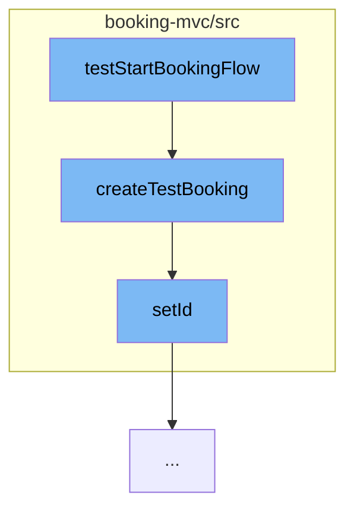

This document will cover the process of creating a test booking in the Spring Web Flow samples project. The process includes:

1. Starting the test booking flow
2. Creating a test booking
3. Setting the ID for the booking.



<SwmSnippet path="/booking-mvc/src/test/java/org/springframework/webflow/samples/booking/BookingFlowExecutionTests.java" line="1" repo-id="Z2l0aHViJTNBJTNBc3ByaW5nLXdlYmZsb3ctc2FtcGxlcyUzQSUzQWdpbGFkbmF2b3Q=">

---

# Starting the Test Booking Flow

The `testStartBookingFlow` function initiates the process of creating a test booking. It's the entry point for this flow.

```java
package org.springframework.webflow.samples.booking;

import org.easymock.EasyMock;
import org.springframework.webflow.config.FlowDefinitionResource;
import org.springframework.webflow.config.FlowDefinitionResourceFactory;
import org.springframework.webflow.core.collection.LocalAttributeMap;
import org.springframework.webflow.core.collection.MutableAttributeMap;
import org.springframework.webflow.test.MockExternalContext;
import org.springframework.webflow.test.MockFlowBuilderContext;
import org.springframework.webflow.test.execution.AbstractXmlFlowExecutionTests;

public class BookingFlowExecutionTests extends AbstractXmlFlowExecutionTests {

    private BookingService bookingService;

    protected void setUp() {
	bookingService = EasyMock.createMock(BookingService.class);
    }

    @Override
    protected FlowDefinitionResource getResource(FlowDefinitionResourceFactory resourceFactory) {
```

---

</SwmSnippet>

<SwmSnippet path="/booking-mvc/src/test/java/org/springframework/webflow/samples/booking/BookingFlowExecutionTests.java" line="72" repo-id="Z2l0aHViJTNBJTNBc3ByaW5nLXdlYmZsb3ctc2FtcGxlcyUzQSUzQWdpbGFkbmF2b3Q=">

---

# Creating a Test Booking

The `createTestBooking` function is called within the `testStartBookingFlow` function. It creates a new `Booking` object with a `Hotel` and a `User`.

```java
    private Booking createTestBooking() {
	Hotel hotel = new Hotel();
	hotel.setId(1L);
	hotel.setName("Jameson Inn");
	User user = new User("keith", "pass", "Keith Donald");
	Booking booking = new Booking(hotel, user);
	return booking;
    }
```

---

</SwmSnippet>

<SwmSnippet path="/booking-mvc/src/main/java/org/springframework/webflow/samples/booking/Booking.java" line="92" repo-id="Z2l0aHViJTNBJTNBc3ByaW5nLXdlYmZsb3ctc2FtcGxlcyUzQSUzQWdpbGFkbmF2b3Q=">

---

# Setting the ID for the Booking

The `setId` function is called within the `createTestBooking` function. It sets the ID for the `Booking` object.

```java
	public void setId(Long id) {
		this.id = id;
	}
```

---

</SwmSnippet>

&nbsp;

*This is an auto-generated document by Swimm AI 🌊 and has not yet been verified by a human*

<SwmMeta version="3.0.0" repo-id="Z2l0aHViJTNBJTNBc3ByaW5nLXdlYmZsb3ctc2FtcGxlcyUzQSUzQWdpbGFkbmF2b3Q=" repo-name="spring-webflow-samples"><sup>Powered by [Swimm](https://app.swimm.io/)</sup></SwmMeta>
