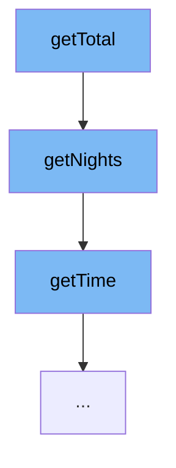

This document will cover the process of calculating the total booking duration in the Spring Web Flow samples project. The process involves the following steps:

1. Invoking the `getTotal` function
2. Calling the `getNights` function
3. Utilizing the `getTime` function.



<SwmSnippet path="/booking-faces/src/main/java/org/springframework/webflow/samples/booking/Booking.java" line="1" repo-id="Z2l0aHViJTNBJTNBc3ByaW5nLXdlYmZsb3ctc2FtcGxlcyUzQSUzQWdpbGFkbmF2b3Q=">

---

# Invoking the getTotal function

The `getTotal` function is the starting point of this flow. It's responsible for initiating the process of calculating the total booking duration.

```java
package org.springframework.webflow.samples.booking;
```

---

</SwmSnippet>

<SwmSnippet path="/booking-faces/src/main/java/org/springframework/webflow/samples/booking/Booking.java" line="77" repo-id="Z2l0aHViJTNBJTNBc3ByaW5nLXdlYmZsb3ctc2FtcGxlcyUzQSUzQWdpbGFkbmF2b3Q=">

---

# Calling the getNights function

The `getNights` function is called within `getTotal`. It calculates the number of nights between the check-in and check-out dates. If either date is null, it returns 0. Otherwise, it calculates the difference in days between the two dates.

```java
	@Transient
	public int getNights() {
		if (checkinDate == null || checkoutDate == null) {
			return 0;
		} else {
			return (int) (checkoutDate.getTime() - checkinDate.getTime()) / 1000 / 60 / 60 / 24;
		}
	}
```

---

</SwmSnippet>

<SwmSnippet path="/primefaces-showcase/src/main/java/org/springframework/samples/webflow/poller/CurrentTimeBean.java" line="10" repo-id="Z2l0aHViJTNBJTNBc3ByaW5nLXdlYmZsb3ctc2FtcGxlcyUzQSUzQWdpbGFkbmF2b3Q=">

---

# Utilizing the getTime function

The `getTime` function is used within `getNights` to get the current time. This function returns a new Date object representing the current date and time.

```java
	public Date getTime() {
		return new Date();
	}
```

---

</SwmSnippet>

&nbsp;

*This is an auto-generated document by Swimm AI 🌊 and has not yet been verified by a human*

<SwmMeta version="3.0.0" repo-id="Z2l0aHViJTNBJTNBc3ByaW5nLXdlYmZsb3ctc2FtcGxlcyUzQSUzQWdpbGFkbmF2b3Q=" repo-name="spring-webflow-samples"><sup>Powered by [Swimm](https://app.swimm.io/)</sup></SwmMeta>
