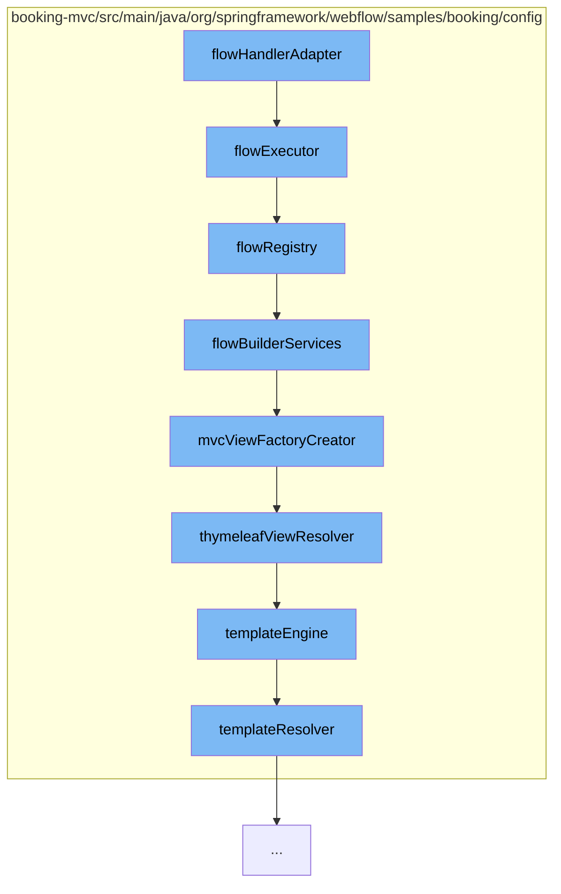

This document will cover the process of handling web flow in the Spring Web Flow project, which includes:

1. Initializing the flow executor
2. Registering the flow
3. Building the flow services
4. Creating the MVC view factory
5. Resolving the Thymeleaf view
6. Setting up the template engine
7. Resolving the template



<SwmSnippet path="/booking-mvc/src/main/java/org/springframework/webflow/samples/booking/config/WebFlowConfig.java" line="22" repo-id="Z2l0aHViJTNBJTNBc3ByaW5nLXdlYmZsb3ctc2FtcGxlcyUzQSUzQWdpbGFkbmF2b3Q=">

---

# Initializing the flow executor

The `flowExecutor` method initializes the flow executor. It adds a `SecurityFlowExecutionListener` to the flow executor for all flows, denoted by '\*'

```java
	@Bean
	public FlowExecutor flowExecutor() {
		return getFlowExecutorBuilder(flowRegistry())
				.addFlowExecutionListener(new SecurityFlowExecutionListener(), "*")
				.build();
	}
```

---

</SwmSnippet>

<SwmSnippet path="/booking-mvc/src/main/java/org/springframework/webflow/samples/booking/config/WebFlowConfig.java" line="29" repo-id="Z2l0aHViJTNBJTNBc3ByaW5nLXdlYmZsb3ctc2FtcGxlcyUzQSUzQWdpbGFkbmF2b3Q=">

---

# Registering the flow

The `flowRegistry` method registers the flow. It sets the base path to '/WEB-INF' and adds a flow location pattern to match all XML files ending with '-flow.xml'

```java
	@Bean
	public FlowDefinitionRegistry flowRegistry() {
		return getFlowDefinitionRegistryBuilder(flowBuilderServices())
				.setBasePath("/WEB-INF")
				.addFlowLocationPattern("/**/*-flow.xml").build();
	}
```

---

</SwmSnippet>

<SwmSnippet path="/booking-mvc/src/main/java/org/springframework/webflow/samples/booking/config/WebFlowConfig.java" line="36" repo-id="Z2l0aHViJTNBJTNBc3ByaW5nLXdlYmZsb3ctc2FtcGxlcyUzQSUzQWdpbGFkbmF2b3Q=">

---

# Building the flow services

The `flowBuilderServices` method builds the flow services. It sets the view factory creator and the validator, and enables the development mode

```java
	@Bean
	public FlowBuilderServices flowBuilderServices() {
		return getFlowBuilderServicesBuilder()
				.setViewFactoryCreator(mvcViewFactoryCreator())
				.setValidator(validator())
				.setDevelopmentMode(true)
				.build();
	}
```

---

</SwmSnippet>

<SwmSnippet path="/booking-mvc/src/main/java/org/springframework/webflow/samples/booking/config/WebFlowConfig.java" line="45" repo-id="Z2l0aHViJTNBJTNBc3ByaW5nLXdlYmZsb3ctc2FtcGxlcyUzQSUzQWdpbGFkbmF2b3Q=">

---

# Creating the MVC view factory

The `mvcViewFactoryCreator` method creates the MVC view factory. It sets the view resolvers and enables the use of Spring bean binding

```java
	@Bean
	public MvcViewFactoryCreator mvcViewFactoryCreator() {
		MvcViewFactoryCreator factoryCreator = new MvcViewFactoryCreator();
		factoryCreator.setViewResolvers(Collections.singletonList(this.webMvcConfig.thymeleafViewResolver()));
		factoryCreator.setUseSpringBeanBinding(true);
		return factoryCreator;
	}
```

---

</SwmSnippet>

<SwmSnippet path="/booking-mvc/src/main/java/org/springframework/webflow/samples/booking/config/WebMvcConfig.java" line="81" repo-id="Z2l0aHViJTNBJTNBc3ByaW5nLXdlYmZsb3ctc2FtcGxlcyUzQSUzQWdpbGFkbmF2b3Q=">

---

# Resolving the Thymeleaf view

The `thymeleafViewResolver` method resolves the Thymeleaf view. It sets the view class and the template engine

```java
	@Bean
	public AjaxThymeleafViewResolver thymeleafViewResolver() {
		AjaxThymeleafViewResolver viewResolver = new AjaxThymeleafViewResolver();
		viewResolver.setViewClass(FlowAjaxThymeleafView.class);
		viewResolver.setTemplateEngine(templateEngine());
		return viewResolver;
	}
```

---

</SwmSnippet>

<SwmSnippet path="/booking-mvc/src/main/java/org/springframework/webflow/samples/booking/config/WebMvcConfig.java" line="89" repo-id="Z2l0aHViJTNBJTNBc3ByaW5nLXdlYmZsb3ctc2FtcGxlcyUzQSUzQWdpbGFkbmF2b3Q=">

---

# Setting up the template engine

The `templateEngine` method sets up the template engine. It adds a new `SpringSecurityDialect`, sets the template resolver, and adds additional dialects

```java
	@Bean
	public SpringTemplateEngine templateEngine(){

		Set<IDialect> dialects = new LinkedHashSet<>();
		dialects.add(new SpringSecurityDialect());

		SpringTemplateEngine templateEngine = new SpringTemplateEngine();
		templateEngine.setTemplateResolver(templateResolver());
		templateEngine.setAdditionalDialects(dialects);
		return templateEngine;
	}
```

---

</SwmSnippet>

<SwmSnippet path="/booking-mvc/src/main/java/org/springframework/webflow/samples/booking/config/WebMvcConfig.java" line="101" repo-id="Z2l0aHViJTNBJTNBc3ByaW5nLXdlYmZsb3ctc2FtcGxlcyUzQSUzQWdpbGFkbmF2b3Q=">

---

# Resolving the template

The `templateResolver` method resolves the template. It builds a web application, sets the prefix and suffix, and sets the template mode to 'HTML5'

```java
	@Bean
	public WebApplicationTemplateResolver templateResolver() {
		IWebApplication application = JakartaServletWebApplication.buildApplication(this.servletContext);
		WebApplicationTemplateResolver resolver = new WebApplicationTemplateResolver(application);
		resolver.setPrefix("/WEB-INF/");
		resolver.setSuffix(".html");
		resolver.setTemplateMode("HTML5");
		return resolver;
	}
```

---

</SwmSnippet>

&nbsp;

*This is an auto-generated document by Swimm AI 🌊 and has not yet been verified by a human*

<SwmMeta version="3.0.0" repo-id="Z2l0aHViJTNBJTNBc3ByaW5nLXdlYmZsb3ctc2FtcGxlcyUzQSUzQWdpbGFkbmF2b3Q=" repo-name="spring-webflow-samples"><sup>Powered by [Swimm](https://app.swimm.io/)</sup></SwmMeta>
